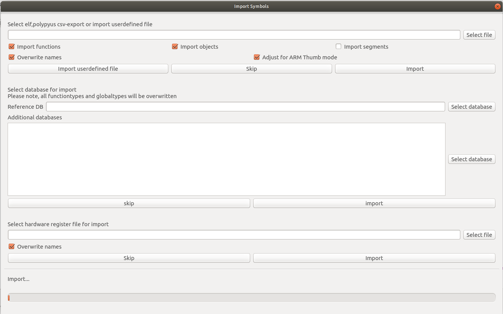
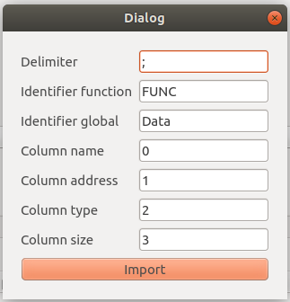
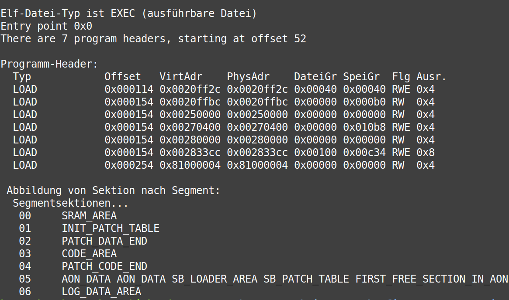
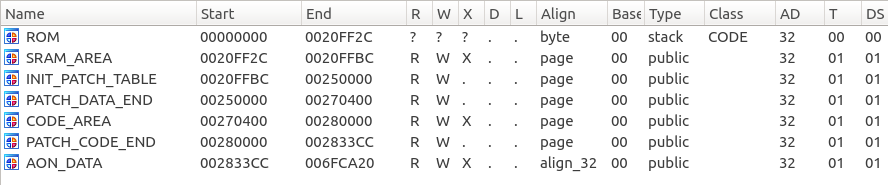
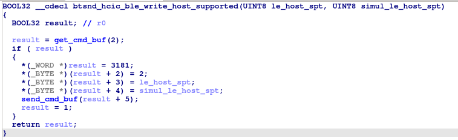
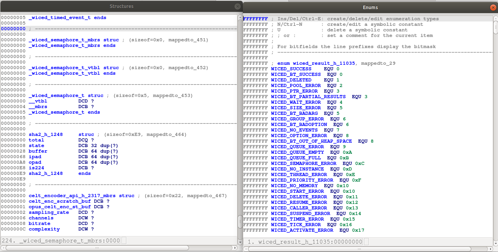
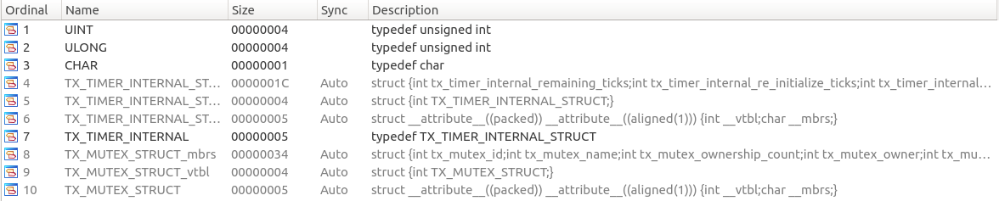

# Signature Import with PDOM databases

WICED Studio,a development platform for Cypress Bluetooth, Wi-Fi and Zigbee firmware, does contain for some chips patch.elf files or symtable files. In addition to that, we found Persistent Document Object Model (PDOM) files, which stores information to restore function signatures and custom types. 
PDOM is a flat binary database with different indexes. We wrote a PDOM-Export tool in java, to convert the flat binary in a SQLite database (PDOM Export). We already exportet all PDOM files from WicedStudio 6.2, they could be found [here](ressources/Databases).
The second part of the project, the PDOM-Import, is a python based IDA-Script, to import symbols by default from patch.elf files, [polypyus](https://github.com/seemoo-lab/polypyus) exportet csv files or user defined csv symtables. After that (or skipped this part) you can select SqLite databases to search for signatures for import. Futher, there is also a feature to import [hardware register](ressources/HardwareRegs).

## PDOM Export
### How to install it
```bash
chmod +x gradlew
./gradlew shadow
```

### How to run it
To run the program, just run it with java:
```bash
java -jar build/libs/PDOM_Export-all.jar
```
### Using PDOM Export
The default usage is the following:
```bash
java -jar build/libs/PDOM_Export-all.jar -P  <PDOM_File>
```
This command creates a new [database](doc/SQLite database.svg) for the pdom file.

The export takes about 20 hours, because a PDOM file could contain about 1.2 million symbols.
You can see the progress in the terminal:
```
Start PDOM Export: 43xxx_WiFi.1472663273205.pdom
A new database has been created.
Creating Connection to Database...
...Connection established
Done: 1/62369(exported symbols: 0) current symbol: (const {bcmdefs.h:8833} &)
Done: 2/62369(exported symbols: 49) current symbol: rrm_input_validation(unsigned int) (local to ries/test/wl_tool/43909B0/wl/exe/wlu.c)
Done: 3/62369(exported symbols: 59) current symbol: NX_IP_DRIVER: NX_IP_DRIVER_STRUCT
```
The following options are supported:
* -D <Path_to_Database> : specify the path to the database, which will be created
* -o : Overrites the database, if there already exists one (default: export will continue)
* -f : print file index
* -l : print all linkages with all there indexes

example:
```bash
java -jar build/libs/PDOM_Export-all.jar -P  ../ressources/PDOM_files/PDOM_WicedStudio_6.2/20706-A2_Bluetooth.1472077679756.pdom -D ./ressources/Databases -o
```
## PDOM Import
**Please note, signature import could override all your defined types and function signatures. Please save a copy of your IDA database and try the import**

### How to install it
there is no instalation needed, just download the folder [PDOM_Import](PDOM_Import/).

### How to run it
1. Open IDA 7.4 or higher and select File -> Script_file... 
2. Select main.py



### Using PDOM Import
At first select your compiler in Options -> compiler...
If you don't set a compiler, no localtype (Typedef) could be imported.
#### First part
If you want to import one of the patch.elf from WicedStudio, we recommend the following steps:
1. Create a new database. ARM v7 little endian, ARM Cortex M for Bluetooth firmware.
2. Mark byte 0x0 as Thumb (`Alt + g`, `0x1`)
3. Select import sections, functions and globals, also select Adjust for ARM Thumb mode
4. Press Import

Default import is for any .elf file or for csv files, which were exported from polypyus.
It is also possible to define an import for any other csv file (userdefined import)


The segment import is only available for .elf files. **Creating new segments will delete all your functions and data**




#### Second part
Import signatures in IDA.
The reference database is the database, which fits to your binary. That reference database has the highest priority for selecting the best signature. 
In addition to that, you can select as many additional databases, as you want. The import will create a csv file with found signatures for each selected database. After that, a final signature file is created with all best found signatures ([PDOM_Signature_Import.pdf](doc/PDOM_Signature_Import.pdf), section 3).
For no reason, there are some import errors displayed. Normaly the import was still successful for shown error, but you can check, whether the import was seccuessfull for the shown signatures.







#### Third part 
Import Hardware register files:
```
  #define clb_sr_cntl_c_adr                              0x00640030                                                   // base_clb_regs_adr + 0x00000004 * 0x0000000c
  #define clb_sr_cntl_c                                  (*(volatile unsigned int *)clb_sr_cntl_c_adr)
  #define clb_sr_cntl_d_adr                              0x00640034                                                   // base_clb_regs_adr + 0x00000004 * 0x0000000d
  #define clb_sr_cntl_d                                  (*(volatile unsigned int *)clb_sr_cntl_d_adr)
```
This part is just useable for a file of the structure above. All register in the file will be imported as data to the associated address.

